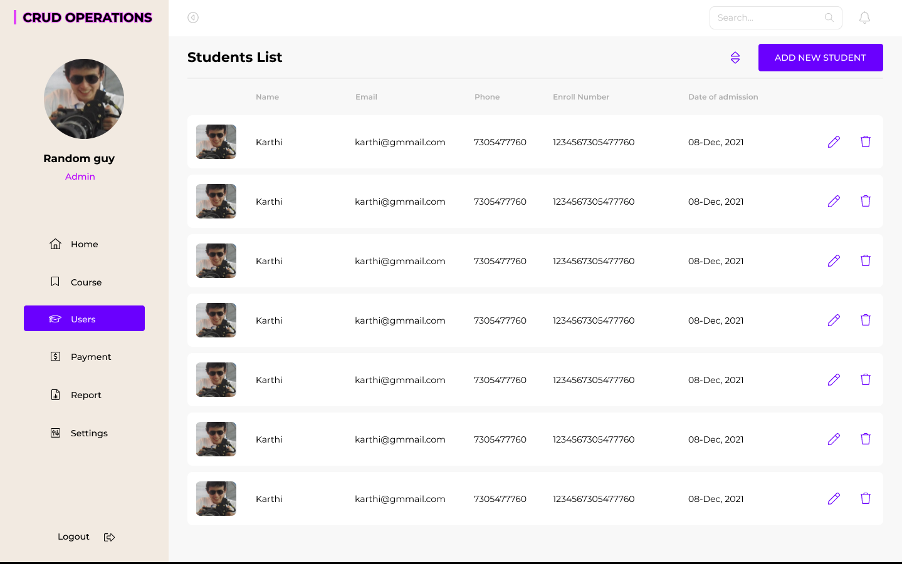

# RETO: Panel de Administración de Usuarios (SPA)


## Objetivo

Desarrollar una **Single Page Application (SPA)** que funcione como un panel de administración de usuarios, implementando todas las operaciones CRUD y siguiendo fielmente el diseño proporcionado en el mockup.

## Descripción

Como desarrollador frontend, deberás crear un panel administrativo que permita gestionar usuarios internos de una empresa. La aplicación debe ser construida usando únicamente **JavaScript Vanilla**, **HTML5** y **CSS3**, sin frameworks o librerías externas (excepto json-server para la API).

## Requerimientos

### Requisitos No Funcionales

#### Tecnologías obligatorias:
- HTML5
- CSS3 (puede usar Flexbox/Grid)
- JavaScript Vanilla (ES6+)
- json-server (para simular API REST)

#### Prohibido usar:
- Frameworks JS (React, Vue, Angular, etc.)
- Librerías CSS (Bootstrap, Tailwind, etc.)
- jQuery u otras librerías de manipulación DOM

### Requisitos Funcionales

#### Módulo de Usuarios (CRUD)
- **C**: Crear nuevos usuarios con validación de formulario
- **R**: Listar todos los usuarios en una tabla
- **U**: Editar información de usuarios existentes
- **D**: Eliminar usuarios con confirmación previa

#### Interfaz de Usuario
- Sidebar de navegación
- Header con información del usuario administrador
- Tabla de usuarios con acciones por fila
- Formulario modal para crear/editar usuarios
- Diseño responsivo para todas las pantallas

#### Estructura de Datos

Cada usuario debe contener como mínimo:
```json
{
  "id": 1,
  "name": "Nombre Completo",
  "email": "correo@ejemplo.com",
  "phone": "1234567890",
  "enrollNumber": "12345678901234",
  "dateOfAdmission": "08-Dec-2021"
}
```

#### Diseño a Implementar

El diseño debe seguir fielmente el mockup proporcionado, respetando:
- Esquema de colores
- Disposición de elementos
- Tipografía y tamaños
- Interacciones y estados de los componentes

#### Entrega Esperada

1. Código fuente organizado y comentado
2. Archivo README.md con instrucciones de instalación y uso
3. Estructura de archivos modular y bien organizada
4. Base de datos simulada (db.json) con datos de ejemplo


## Consejos y Recomendaciones

- Planifica tu estructura de archivos antes de comenzar
- Implementa primero la funcionalidad básica, luego mejora el UI
- Utiliza módulos ES6 para organizar tu código
- No olvides manejar adecuadamente los errores de la API
- Implementa validaciones en los formularios


# Demo mockup



enlace a figma [figma](https://www.figma.com/design/OAzN08ifwUcxwSCh66clvz/Crud-Operations--Community---Copy-?node-id=0-1&m=dev&t=lW0hyDFNaxBAdWel-1)

**¡Buena suerte y feliz codificación!**
